# 围棋AI定式棋型索引

[TOC]

## 1-小目挂角

### 1.1 小飞挂角

#### (1) 二间低夹

###### #1二间低夹基本型

> 

###### #2二间低夹反制型

反制对方二间低夹

> 3.11.mp4

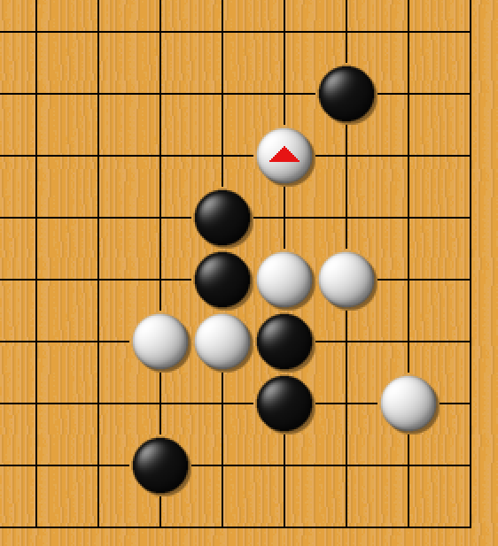

###### #3二间低夹变招型

> 3.12.mp4

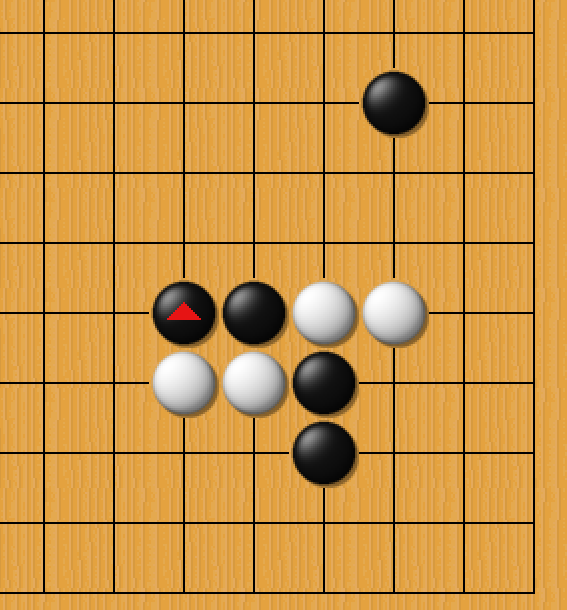

### 1.2 高挂

#### (1) 二间低夹

#### (2) 小雪崩新型

> 9.3.mp4

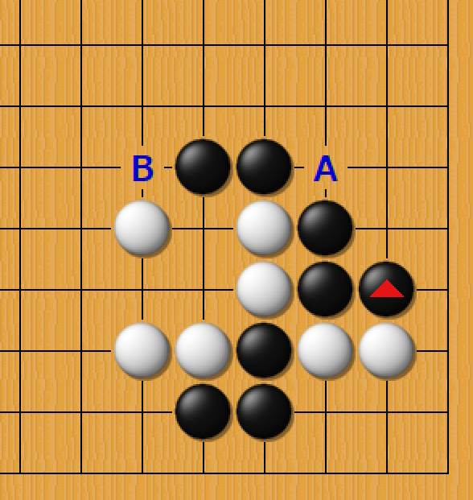

## 2-小目守角

### 2.1 大飞守角

> 10.15.mp4

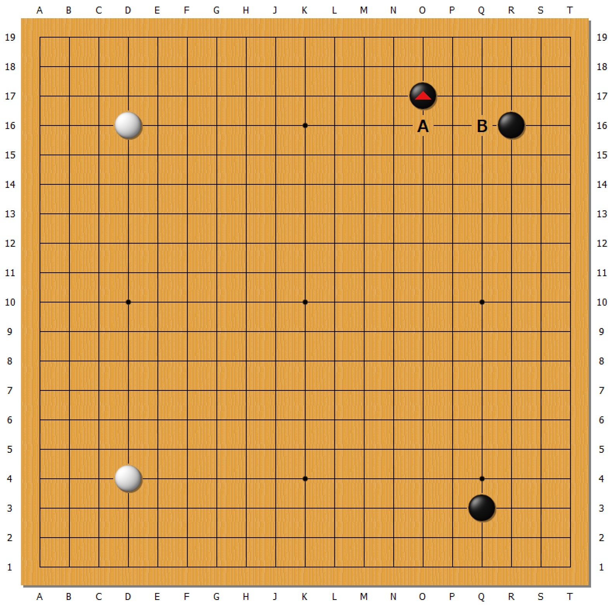

## 3-星位

### 3.1 小飞挂角

###### #飞点型1

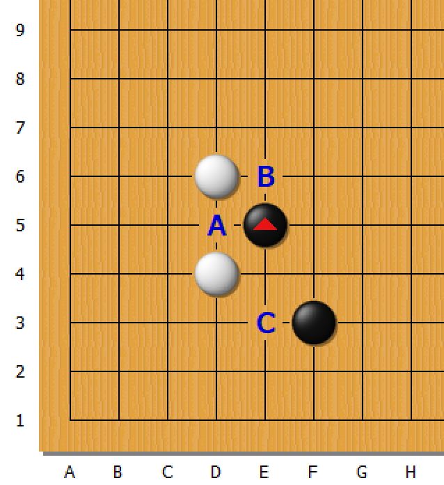

## 黑布局

###### #黑布局1

> 2.18.mp4

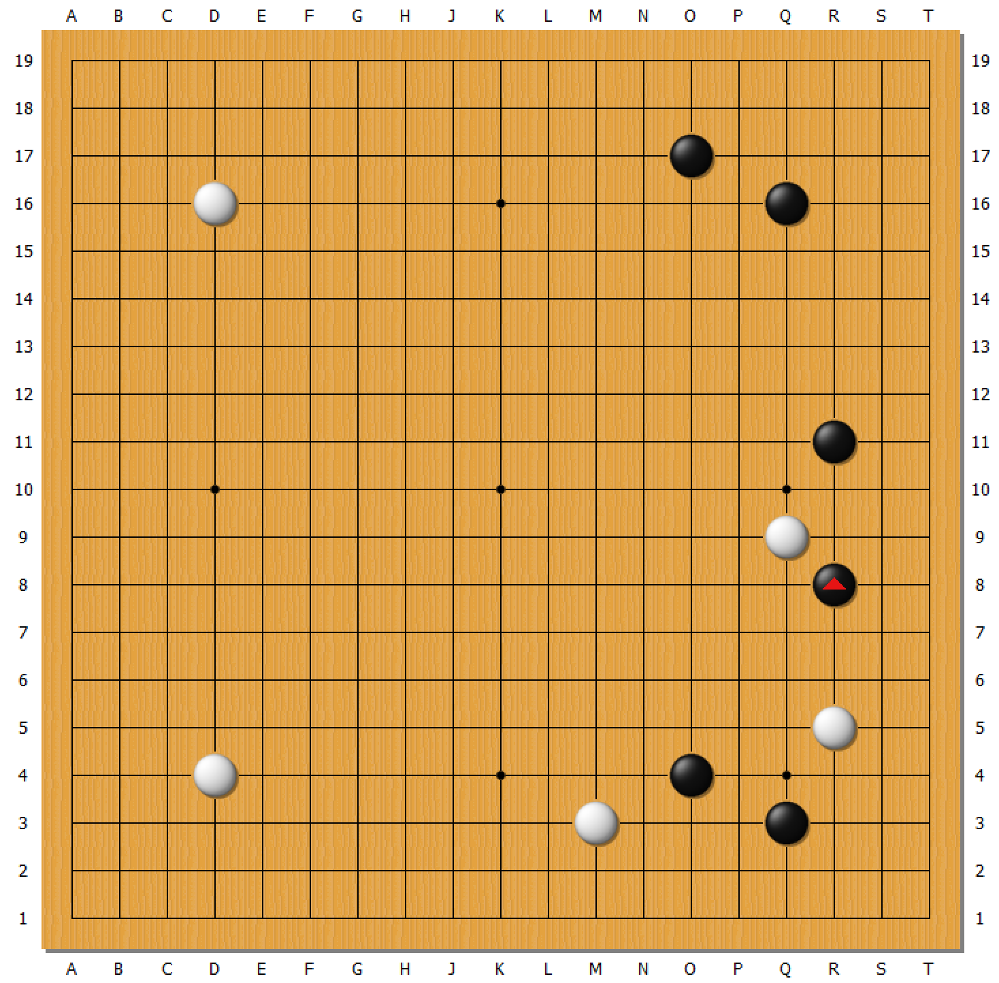

###### #黑布局1-反制

> 2.12.mp4

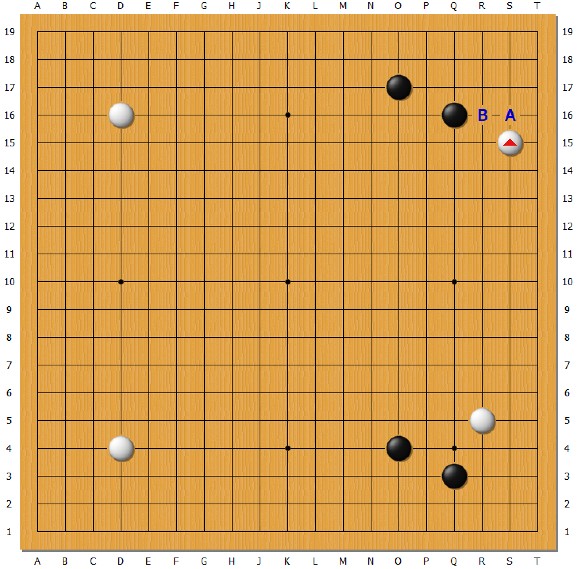

###### #黑布局2-反制

> 7.22.mp4

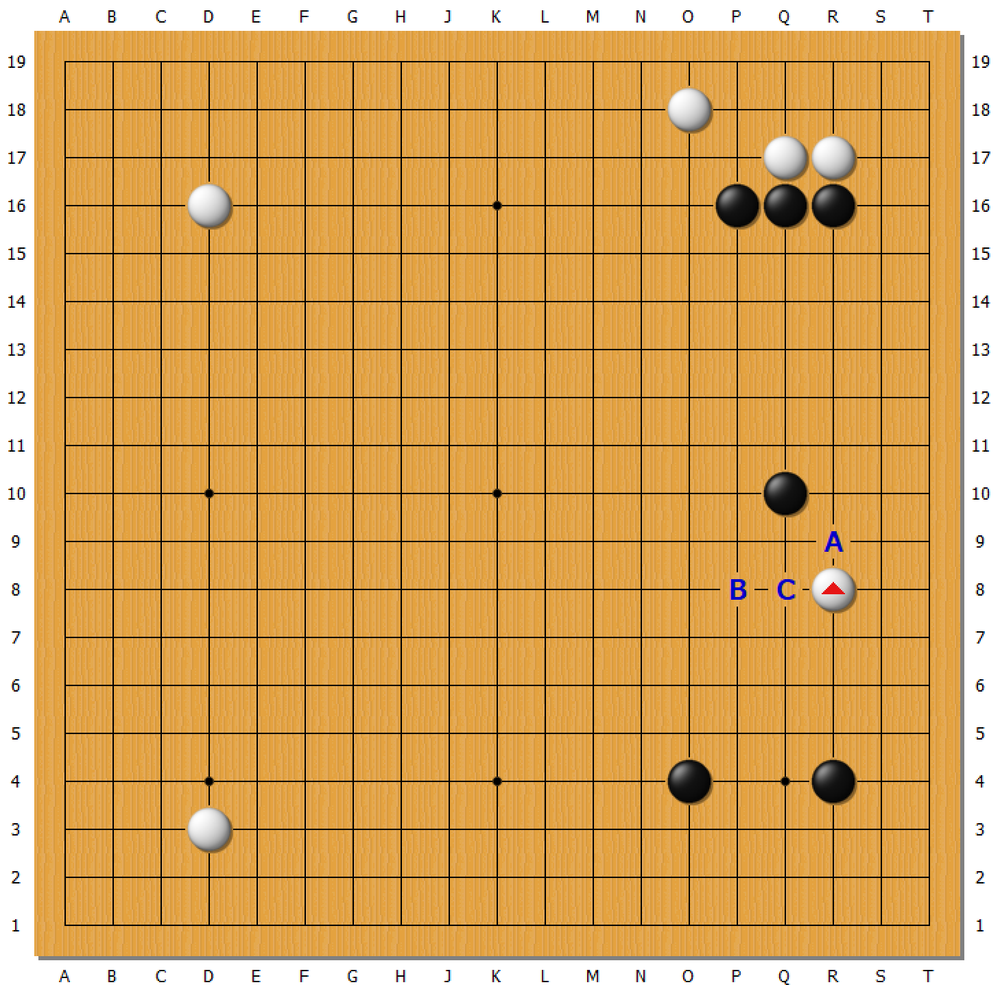

###### #黑布局3

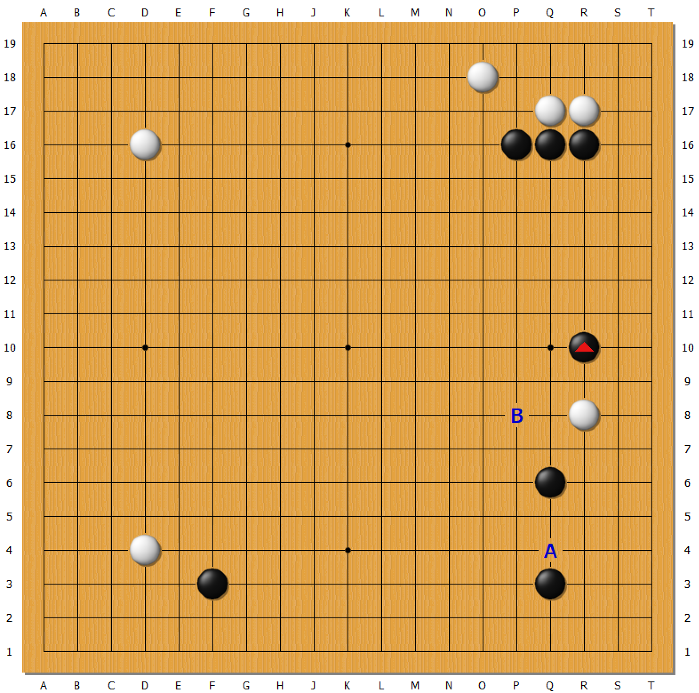

## 白布局

###### #白布局1

> 3.25.mp4、4.1.mp4

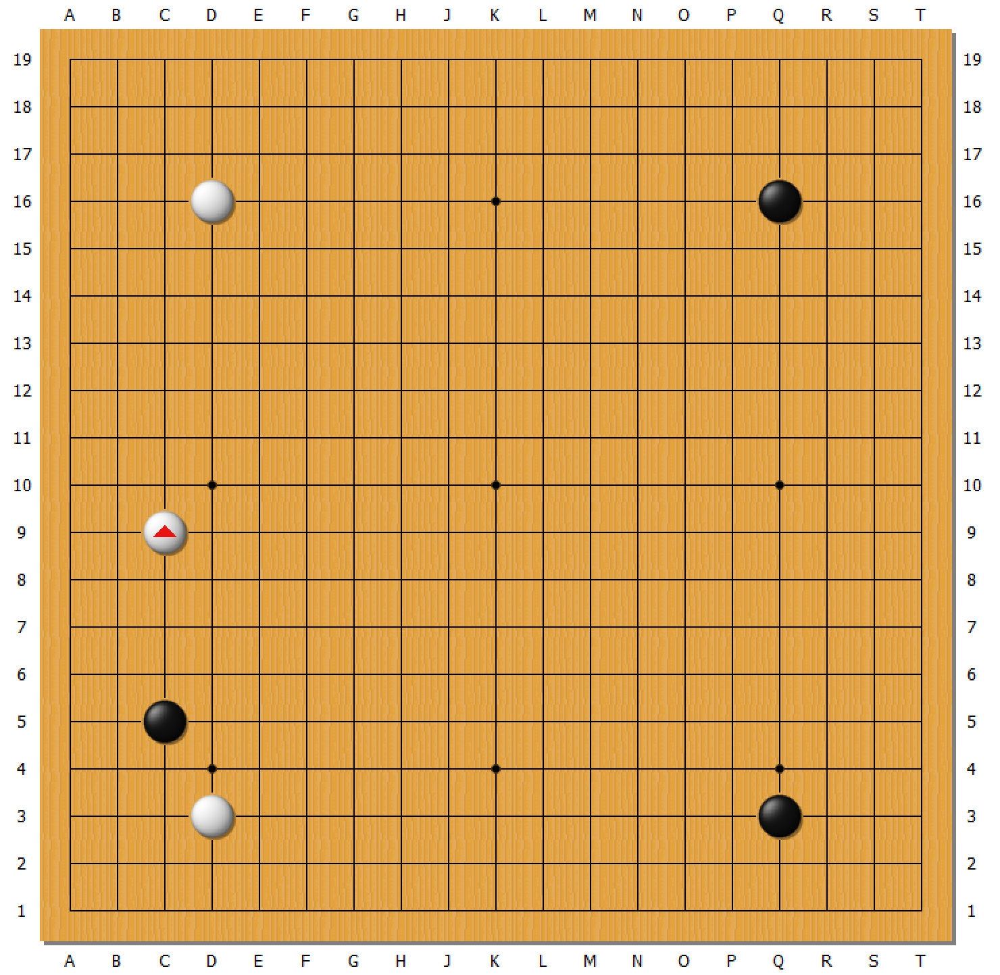

###### #白布局2

> 5.14.mp4

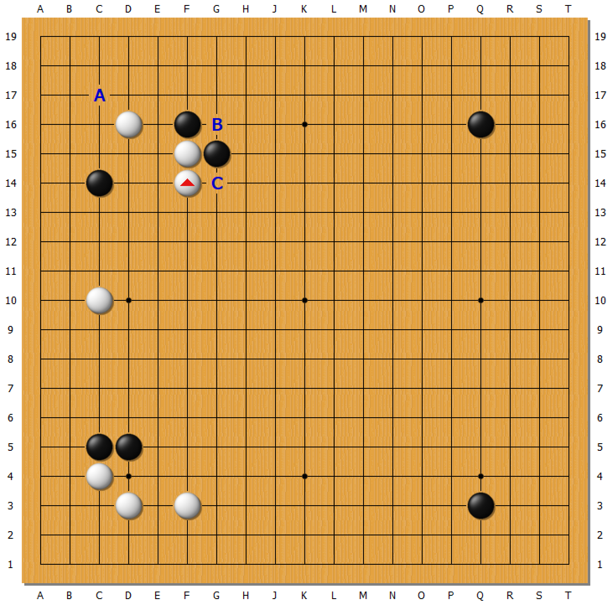

